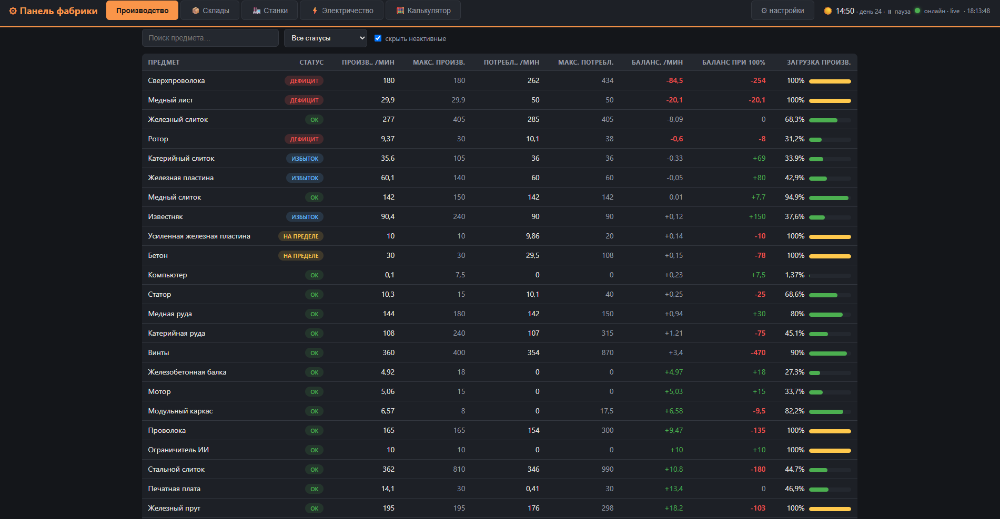
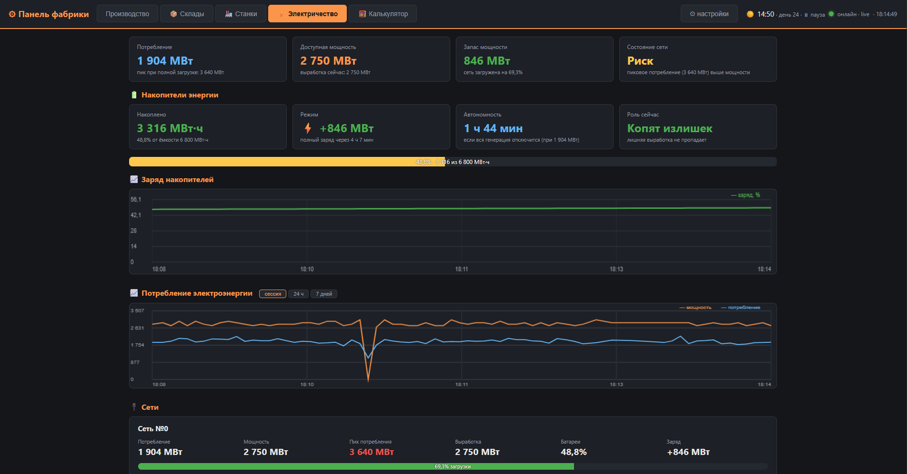
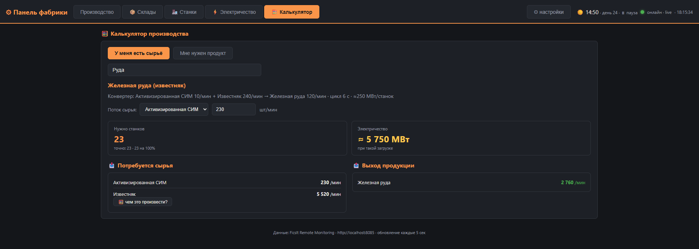

# ⚙ Панель фабрики Satisfactory

Веб-панель мониторинга и управления фабрикой в **Satisfactory** — работает поверх мода
[FicsIt Remote Monitoring](https://ficsit.app/mod/FicsitRemoteMonitoring). Открывается в браузере
на любом устройстве домашней сети, обновляется в реальном времени и умеет не только показывать,
но и управлять: выключать станки, крутить генераторы «круговым рубильником», слать тревоги в игровой чат.

## Возможности

- **📊 Производство** — производство/потребление/баланс каждого предмета, статусы
  (дефицит, на пределе, избыток мощности), автоматические советы «что чинить в первую очередь».
  Клик по предмету — карточка с графиками, списком производителей и потребителей (с рецептами).
- **📦 Склады** — запасы всех хранилищ, тренд (растёт/тает), прогноз «закончится через N минут», мини-графики.
- **🏭 Станки** — все станки с диагностикой (нет сырья / нет питания / выход забит / приторможен спросом),
  включение и выключение — по одному или массово (фильтр → выбрать все → выключить).
  Кнопка 📍 ставит метку на станке прямо в мире игры.
- **⚡ Электричество** — потребление/мощность/запас по сетям, накопители (заряд, режим, автономность),
  генераторы с запасом топлива и временем до опустошения. Клик по типу генераторов открывает
  **круговой рубильник**: выбираете, сколько генераторов должно работать — панель переключает сама.
- **🧮 Калькулятор** — на настоящих рецептах из игры: «есть 240 руды/мин — сколько плавилен?»
  или «хочу 100 деталей/мин — сколько станков и сырья?», с проваливанием по цепочке до руды
  и оценкой электричества.
- **🔔 Тревоги** — перегрузка сети, сработавший предохранитель, разряд батарей, топливо на исходе.
  Каналы на выбор: пуш-уведомления браузера, **сообщения в игровой чат**, звук.
- **📈 История** — графики за сессию, 24 часа и 7 дней (хранится в браузере 14 дней).
- **Обновление раз в 5 секунд**; опционально — live-режим по WebSocket (см. предупреждение ниже).
- **PWA** — устанавливается как отдельное приложение с иконкой.

## Зависимости

| Что | Зачем |
|---|---|
| [Satisfactory](https://www.satisfactorygame.com/) | сама игра |
| Мод [FicsIt Remote Monitoring](https://ficsit.app/mod/FicsitRemoteMonitoring) | отдаёт данные фабрики по HTTP/WebSocket (ставится через [Satisfactory Mod Manager](https://smm.ficsit.app/)) |
| [Python 3.7+](https://www.python.org/downloads/) | крошечный локальный сервер панели (`serve.py`), ничего ставить дополнительно не нужно |
| Chrome / Edge / другой браузер | сама панель; для пушей и PWA рекомендуется Chrome |

## Установка

1. **Поставьте мод.** В Satisfactory Mod Manager найдите *FicsIt Remote Monitoring* и установите.
2. **Включите веб-сервер мода.** В игре откройте чат и выполните `/frm http start`,
   либо включите автозапуск: Настройки → Моды → FicsIt Remote Monitoring → *Web Server Autostart*.
   Там же можно сменить порт (по умолчанию **8080**).
3. **Скачайте панель** (Code → Download ZIP или `git clone`) и распакуйте в любую папку.
4. **Запустите `запустить-панель.bat`** — он поднимет сервер панели на порту 8086
   и откроет в браузере http://localhost:8086/dashboard.html.
   (Не Windows? Просто выполните `python serve.py` и откройте тот же адрес.)
5. Если мод работает не на порту 8080 — нажмите **⚙ настройки** в шапке панели и укажите свой порт.

Готово — данные фабрики уже на экране.

### Управление фабрикой (опционально)

Чтобы панель могла выключать станки, крутить генераторы, писать в чат и ставить метки,
ей нужен токен авторизации мода:

1. В игре: Настройки → Моды → FicsIt Remote Monitoring → скопируйте **Authentication Token**.
2. В панели: **⚙ настройки** → вставьте токен в поле «Токен мода».

Токен хранится только в вашем браузере. ⚠ Любой, кто откроет панель в вашей сети и введёт токен,
сможет управлять фабрикой — для домашней сети это обычно не проблема.

### Уведомления

- **В игровой чат** — работают сразу (нужен токен), видно прямо в игре.
- **Пуш браузера** — нажмите ⚙ → включите «Пуш-уведомления» → разрешите в браузере.
  Windows: проверьте, что «Не беспокоить» не глушит уведомления во время игры
  (Параметры → Система → Уведомления). macOS: разрешите уведомления Chrome в Системных настройках.
- Кнопка **«Отправить тест»** в ⚙ проверяет все каналы разом.

### Доступ с других устройств (ноутбук, планшет)

1. На игровом ПК запустите один раз `открыть-порты.bat` (откроет порты 8085/8086 в брандмауэре;
   если у мода другой порт — поправьте в файле).
2. На другом устройстве откройте `http://IP-игрового-ПК:8086/dashboard.html`.
3. Для пуш-уведомлений на таком адресе Chrome требует флаг:
   `chrome://flags/#unsafely-treat-insecure-origin-as-secure` → впишите адрес панели → Enabled → перезапуск.

### Автозапуск (опционально)

Ярлык на `запустить-панель.bat` в папку автозагрузки (`Win+R` → `shell:startup`) —
сервер панели будет подниматься при входе в Windows.

## Частые вопросы

**«Нет связи»** — игра не запущена, веб-сервер мода не включён (`/frm http start`)
или в ⚙ указан не тот порт.

**Кнопки управления пишут «не поддерживается»** — мод умеет переключать конструкторы, сборщики,
манифактуры, генераторы и рубильники; буровые и экстракторы воды — нет.

**История 24ч/7д пустая** — она пишется, пока вкладка панели открыта (мод ничего не хранит).
Держите панель открытой фоном.

**⚠ Live-режим (WebSocket) может крашить игру.** В моде есть известная ошибка
([issue #230](https://github.com/porisius/FicsitRemoteMonitoring/issues/230)): его WebSocket-пуш
иногда роняет игру с `EXCEPTION_ACCESS_VIOLATION` в `PushUpdatedData()`. Поэтому по умолчанию
панель опрашивает мод по HTTP раз в 5 секунд — это безопасно. Live-режим можно включить
в ⚙ настройках на свой страх и риск; когда баг мода исправят, включайте смело
(статус в шапке сменится на «онлайн · live»).

## Лицензия

MIT — делайте что хотите, упоминание приветствуется.
